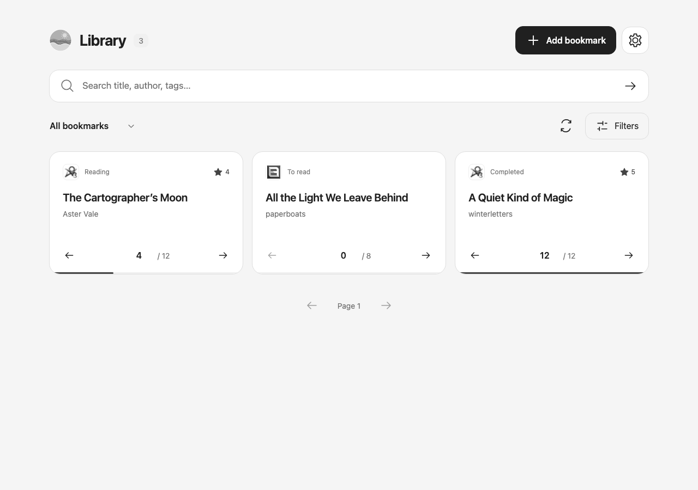

# Sailune Desktop


A Windows and Linux desktop home for your fanfiction bookmarks. Built with **Wails 2, Svelte 5, TypeScript, and Sailune-Go**, following the shared-core architecture planned for Sailune.

Desktop and the CLI are peer clients of the same Go library and SQLite store. Desktop imports `github.com/styxnanda/sailune-go` directly; the CLI executable does not need to be installed separately. Each release archive also bundles a standalone `sailune` command for terminal use. Wails uses the platform webview inside a desktop window, rather than native platform widgets. A future macOS SwiftUI client is outside this project’s MVP.

## MVP features

| CLI capability | Desktop location |
| --- | --- |
| Add automatically or offline | Add bookmark; switch off “Fetch details automatically” for offline entry |
| Search, every filter, sorting and pagination | Search your stories, shelf selector, Filters |
| All bookmark and website fields | Open a story → Details; Copy details |
| Personal title, author, shelf, progress, tags, notes, rating, review | Open a story → Edit bookmark; chapter progress also saves directly on cards |
| Added and last-read dates | Edit bookmark → Dates |
| Every story-detail override and individual/all resets | Edit bookmark → Custom details |
| Refresh website details | Open a story → Refresh details |
| Open work, chapter, next unread, resolve/copy links | Read next, Open website, chapter carousel |
| Delete | Remove bookmark, followed by confirmation |
| Login, check connection, browser/profile import | Settings → Connected websites |
| Session-file import, migration and clearing | Connected websites → Other methods / Disconnect website |
| Export, restore, merge and legacy library import | Settings → Save a backup / Import collection |
| Library and sign-in location overrides, custom User-Agent | Settings → Library |


Browser import can be performed before adding or refreshing a story. Fetching reuses the selected site’s saved encrypted session. Opening a story never marks it read. Failed fetches preserve the form, and personal fields and overrides survive metadata refreshes.

Lists use SQL pagination (20, 50, 100, or 200 records), keeping rendering bounded. Refresh collection or returning focus to the library refreshes external CLI changes. Forms submit only changed personal fields. If two clients edit the same field, the last successful write wins. Location changes last for the current desktop session; environment overrides persist across launches.

## Development

Keep the two repositories beside each other:

```text
Projects/
  sailune-cli/       # repository: styxnanda/sailune-go
  sailune-desktop/
```

The local `go.mod` replacement intentionally uses `../sailune-cli`, so ongoing core changes are immediately available to Desktop. CI checks out core commit `68e220e6049f0d8ffd28448941c22c28cac6cadb`. Update that pin deliberately when adopting later core APIs.

Prerequisites: Go 1.25+, Node.js 22+, and the [Wails platform dependencies](https://wails.io/docs/gettingstarted/installation/). Windows needs WebView2. Ubuntu 24.04 needs GTK 3 and WebKitGTK 4.1 development packages:

```sh
sudo apt install build-essential pkg-config libgtk-3-dev libwebkit2gtk-4.1-dev
go install github.com/wailsapp/wails/v2/cmd/wails@v2.15.0
npm ci --prefix frontend
```

Start on Windows with `wails dev`; on Linux with WebKitGTK 4.1 use `wails dev -tags webkit2_41`. For isolated development, set `SAILUNE_DATA` to an absolute path to a disposable SQLite file and `SAILUNE_SESSIONS` to a disposable directory before starting.

```sh
npm --prefix frontend run check
npm --prefix frontend run build
go test -race ./internal/desktop
go vet ./internal/desktop
# Optional browser interaction tests (synthetic data; no personal library access)
cd frontend
npx playwright install chromium
npm test
```

A browser-only `npm run dev` has no Go bridge and displays an explicit connection error. Synthetic data is injected only by tests; the shipped app has no demo or fake persistence fallback.

## Windows and Linux builds

```sh
# Windows host
wails build -platform windows/amd64
# Linux host with WebKitGTK 4.1
wails build -platform linux/amd64 -tags webkit2_41
```

Outputs go to `build/bin`. The supplied icon is `build/appicon.png`; Wails uses it for the Windows executable resources. Linux receives the icon through Wails window options and the included desktop launcher. A Linux release archive includes `install.sh`, which installs both Desktop and CLI plus the launcher for the current user. The repository’s `build/linux/install.sh` is a desktop-only development install helper. Ensure `~/.local/bin` is on PATH.

The GitHub Actions workflow builds on Windows and Ubuntu and uploads archives containing Desktop, the standalone CLI, licenses, and build information. A `v*` tag publishes the Windows ZIP, Linux tar.gz, and SHA256SUMS as a GitHub prerelease after both builds pass. No macOS release, certificate signing, auto-update system, or graphical installer is included in this MVP. See the [Wails build guide](https://wails.io/docs/gettingstarted/building/) for platform toolchain requirements.

## Storage and boundaries

Defaults and `SAILUNE_DATA`, `SAILUNE_SESSIONS`, and `SAILUNE_USER_AGENT` match the CLI. The SQLite library and JSON exports contain plaintext personal data. Session files are encrypted by Sailune-Go using OS-held keys; Linux requires a working Secret Service. Session status counts usable cookies locally and does not establish server authentication.

Use snapshots for transfer; do not synchronize a live SQLite file through cloud storage or a network share. Restore without merge requires a pristine destination, and export refuses to overwrite existing files. Legacy JSON migration keeps the source; successful session migration removes its original plaintext file.

The GUI inherits the core’s scraping and browser limitations, including possible AO3/FFN challenges and unsupported Windows v20 browser cookies, KWallet, Firefox containers, and partitioned cookies. It stores bookmarks and metadata, not full stories. No real browser cookies are accessed by automated tests.

## Layout

- `internal/desktop`: testable request adapter over Sailune-Go.
- `app.go`: Wails bridge, native file dialogs, and core-resolved browser launching.
- `frontend/src`: library, editor, settings, and typed bridge.
- `build`: shared icon, Linux launcher and installation helper.
- `.github/workflows/build.yml`: Windows/Linux build checks.

Licensed under [GPL-3.0](LICENSE).

## Verification status

Verified in the development workspace: TypeScript/Svelte checks (no warnings), production frontend build, Go race tests and vet, six Playwright interaction tests with synthetic bookmarks, and a successful Wails Windows AMD64 executable build including icon resources. The bookshelf, editor, story, and preferences screens were visually inspected. Keyboard focus, Escape dismissal, reduced motion, failed-save recovery, explicit session consent, filtering, and zero-valued custom details are covered by the interaction tests.

The Ubuntu CI job has built and packaged the Linux app and smoke-tested its bundled CLI. Native desktop interaction on Windows and Linux still needs manual verification. A local Apple Silicon macOS app has been built and startup-tested with isolated storage. Real authenticated AO3/FFN access and OS credential dialogs have not been exercised by this desktop implementation. Request cancellation interrupts fetches; already committed local writes cannot be undone.

## Downloads include the CLI

Download and extract the entire platform archive from GitHub Releases. The desktop app embeds the Go library, while the accompanying CLI is a separate executable built from the same pinned core checkout:

- Windows: `sailune-desktop.exe` and `sailune.exe` in the ZIP. Run `.\sailune.exe --help` in PowerShell.
- Linux: `sailune-desktop` and `sailune` in the tar.gz. Run `./sailune --help`, or `sh install.sh` to install both commands.

The binaries do not require Go or Node.js on the destination machine. Native webview/runtime dependencies listed above still apply. Both clients use the same default SQLite library and session directory. Bundling does not add the CLI to PATH automatically on Windows; it can be invoked directly from the extracted folder.

## Local macOS test build only

For local testing on a Mac with Xcode Command Line Tools installed:

```sh
sh scripts/build-macos-local.sh
```

This builds for the Mac’s architecture and creates an ad-hoc-signed `Sailune.app` with the CLI inside `Contents/MacOS/sailune`. The output is under `build/staging/sailune-v0.1.0-darwin-ARCH/`; a local ZIP is under `build/packages/`. Open that `Sailune.app` to test. On Apple Silicon the architecture is `arm64`.

This is the same Wails interface for development testing, not the planned SwiftUI client. The script is never invoked by GitHub Actions, and macOS assets are never included in the release workflow.

## Interface

A monochrome library with compact bookmark cards, search, and focused dialogs. Concise labels and large controls keep every core feature accessible without a persistent navigation bar.

Cards include one-click chapter progress and an editable chapter number that saves on Enter or blur. The chapter carousel slides between numbers; click its number for open/link actions, or use Jump to for a specific chapter. Browsing chapters does not mark them read.

Dropdowns use keyboard-accessible menus (arrows, type to search, Enter, Escape). Settings → Customize theme saves a light/dark preference on this device; the initial choice follows the system. Site icons are bundled locally.

Buttons and disclosures use subtle spring feedback; dialogs ease into view. The app respects reduced motion. Press Ctrl/Cmd+K to search or Ctrl/Cmd+N to add a bookmark.



Preview uses synthetic test bookmarks.
